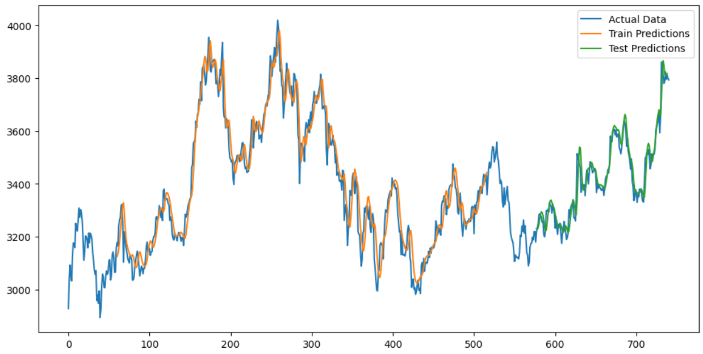

### Stock Price Prediction Using LSTM

In this project, we developed a machine learning model to predict stock prices based on historical data using a Long Short-Term Memory (LSTM) neural network. The dataset consists of closing prices for multiple stocks, and the main steps involved in the project were:

1. **Data Preprocessing**: We scaled the stock prices using MinMax scaling to normalize the data, ensuring that the model could learn efficiently. We then created sequences of 60 past prices (the `seq_length`) to predict the future stock price.

2. **Model Architecture**: We built an LSTM-based neural network with four LSTM layers. These layers capture the temporal dependencies in stock price movements. A final Dense layer was used to output the predicted price.

3. **Training**: The model was trained using the past stock prices as input (`x_train`) and the next price as the target (`y_train`). We used the Adam optimizer and mean squared error as the loss function, training the model for 50 epochs.

4. **Prediction and Evaluation**: After training, the model's predictions were compared with the actual stock prices. The performance of the model was visualized by plotting the predicted prices against the actual prices.

This project demonstrated how LSTMs, which excel at handling sequential data, can be applied to time series forecasting for stock prices.

## Introduction

Stock price prediction is a challenging task due to the volatile nature of the stock market. This project aims to build a machine learning model using an LSTM neural network that can predict future stock prices based on historical data. LSTM models are well-suited for sequential data and are commonly used for time series forecasting tasks like this.

## Project Workflow

The project consists of the following key steps:

1. **Data Collection**: Stock price data is collected from the NSE website using the `yfinance` library. The data includes information such as closing price, high, low, and volume.
   
2. **Data Preprocessing**: 
    - We use the closing price for training.
    - The data is normalized using `MinMaxScaler` to scale values between 0 and 1 to improve model efficiency.
    - Sequences of 60 past closing prices are created to predict the next day's closing price.
    
3. **Model Building**:
    - The model is built using an LSTM architecture with four stacked LSTM layers.
    - Each LSTM layer has 50 units, and the model uses the Adam optimizer and mean squared error as the loss function.

4. **Training**: The model is trained using the past sequences as inputs (`x_train`) and the actual prices as labels (`y_train`). The model is trained for 50 epochs with a batch size of 32.

5. **Evaluation**: The trained model predicts stock prices on the test data, and its performance is evaluated by comparing the predicted values with actual stock prices.

6. **Visualization**: The results are visualized by plotting the actual and predicted stock prices on a graph.

## Model Architecture

The LSTM model used in this project consists of:

- **Input Layer**: Takes the input sequence of stock prices.
- **LSTM Layers**: 
    - 4 LSTM layers, each with 50 units.
    - The first 3 LSTM layers return sequences to maintain the sequence structure.
    - Dropout layers can be added (optional) after each LSTM layer to prevent overfitting.
- **Dense Layer**: Outputs the predicted stock price.
- **Loss Function**: Mean squared error (MSE).
- **Optimizer**: Adam optimizer.

```python
model = Sequential()
model.add(LSTM(units=50, return_sequences=True, input_shape=(seq_length, 1)))
model.add(LSTM(units=50, return_sequences=True))
model.add(LSTM(units=50, return_sequences=True))
model.add(LSTM(units=50))
model.add(Dense(1))

model.compile(optimizer='adam', loss='mean_squared_error')
```


---


## Results
```markdown

The model was able to capture the general trends in stock price movements. The predicted stock prices were plotted alongside actual stock prices to visually evaluate the model’s performance.```

```

## Technologies Used

- **Python**: Primary programming language.
- **TensorFlow/Keras**: Used to build the LSTM model.
- **Pandas**: Data manipulation and analysis.
- **NumPy**: For numerical computations.
- **Matplotlib**: For visualizing stock price trends.
- **yfinance**: For downloading stock price data.

## Dataset

The dataset used in this project consists of historical stock prices downloaded using the `yfinance` library. The data includes the stock’s open, high, low, close prices, and volume.

You can download stock price data using the following code snippet:

```python
import yfinance as yf
data = yf.download('TCS.NS', start='2020-01-01', end='2023-01-01')
```

## References

- "Long Short-Term Memory (LSTM)" - Hochreiter, S., & Schmidhuber, J. (1997)
- [Keras Documentation](https://keras.io/)
- [yfinance Documentation](https://pypi.org/project/yfinance/)
